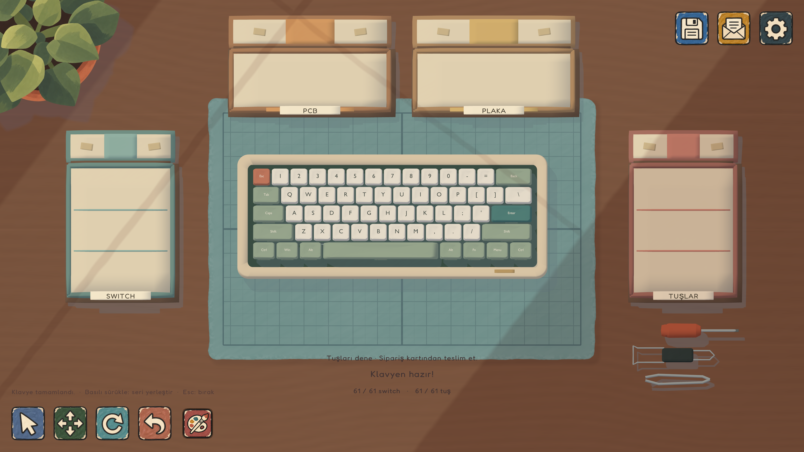

# Cozy Board

A cozy, painterly keyboard assembly game built in **Unity 6000.5.6f1 / URP**.

Gameplay and narrative direction (Turkish; opening, selectable orders, repair jobs, six-key macro pads and narrative saves implemented): [Game system and story](Documentation/GameDesignAndStory.md).

After the first story keyboard (or the current delivery from an older save), the laptop offers three job types: a short repair with three neighbour tests and one replacement switch; a six-key macro pad with configurable in-game shortcuts; and a full keyboard. Small jobs consume only the needed loose parts. Save version 12 preserves product layout, repair diagnosis, macro functions, unused parts and existing artwork. New builds do not add artificial faults to newly manufactured boards; faults already stored in old saves still need repair.

This repository contains only the Unity version. Open this folder in Unity Hub, then open `Assets/CozyBoard/Scenes/Workbench.unity` and press Play.



## Build the keyboard

- Four open cardboard supply boxes: PCB, plate, switches and keycaps.
- Assembly follows the physical dependency order: PCB, plate, all switches, then keycaps.
- Pick a cap from its box: its width, shape and legend adapt to the destination socket.
- Hold the left mouse button and sweep over sockets to place successive parts. An occupied socket never consumes another part.
- Alternatively, drag and release one piece, or click to pick up and click again to place.
- Parts align, press against a little resistance, click into place and settle.
- The subtle dashed guide appears only at a valid target while holding a part.
- Test installed keys with mouse clicks or your physical keyboard, including before the board is complete.

### Controls

| Input / icon | Action |
|---|---|
| Left mouse on a box or loose part | Pick up |
| Hold and sweep over keyboard | Repeated placement |
| Escape | Return the held part / close a panel |
| Right mouse drag | Small camera orbit |
| Middle mouse drag | Small camera pan |
| Mouse wheel | Zoom |
| Arrow icon | Place parts |
| Four-arrow icon | Move the keyboard case or tools |
| Circular arrow icon | Rotate a case/tool by clicking it |
| Paint-brush icon | Select an installed key and paint directly on its 3D surface |
| Mouse wheel in paint studio | Zoom |
| Right / middle drag in paint studio | Orbit the 3D keycap, including its sides |
| Shift + mouse wheel in paint studio | Change brush / tape size |
| Alt + left mouse in paint mode | Sample a color from a keycap |
| F in paint studio | Reset the view |
| Ctrl / Cmd + Z or Y | Undo / redo paint |
| Curved arrow icon | Undo the latest placement |
| Floppy disk icon | Save the current order and assembly |
| Envelope icon | Open customer order / deliver completed board |
| Gear icon | Independent music and effect volumes |

The save file is `workshop-save.json` in Unity's `Application.persistentDataPath`. A saved order is restored on launch. Assembly progress is saved explicitly using the disk icon; delivery also saves. Undo history lasts for the current session. Parts use direct manipulation, not rigidbody simulation.

The paint studio renders the actual sculpted keycap with studio lighting. Orbit the model to paint the top, bevels and side walls directly. Six separate 512-pixel texture islands keep opposite faces independent; brush strokes are evaluated on the 3D surface and interpolated along the pointer path. A surface-aligned brush ring shows the contact area. The color wheel, value slider, brush tips, fill and undo/redo controls remain available beside the model. Raised legends can be shown or hidden. Saved artwork includes side paint; older flat artwork migrates to the top face.

Verify the 3D paint and save migration with `unity run . -- -executeMethod CozyBoard.Editor.WorkshopStudioVerify.Run`. The Editor menu **Cozy Board → Preview 3D paint studio** temporarily assembles the keyboard and opens a key for inspection in Play mode; it does not write the player save.

## Art and audio

Warm amber ground with restrained marks, an imperfect teal cutting mat, rounded cream keyboard case, sculpted keycaps and simple painted boxes. Dynamic projected mesh silhouettes produce colored, offset shadows. Background light and the parts share the same window-shadow coordinates.

Game output defaults to **3840×2160**, with Retina support and 4× MSAA. The actual window size depends on the display. Procedural surfaces, geometry and text render at native resolution. Raster sources are documented honestly in `Documentation/GeneratedArt.md`: the 1672×941 icon atlas and 1024×1536 clipboard are displayed at or below their source pixel density in the UHD interface. A 4K render does not imply every source image is 4K.

Recorded Cherry MX Red PBT switches and the “Chill lofi inspired” music were reused from the user's existing `keyboard/LittleSwitch` project. That project also supplied the installation timing. The `keyboardV2/KeyboardWorkshop` folder was inspected; its walking-only scene had no assembly interaction or recorded keyboard sounds.

See [third-party notices](THIRD_PARTY_NOTICES.md) for the MIT sound license and CC0 music credit.

## Review images

All are **3840×2160 images rendered by Unity**, not concept mockups:

- [Initial workbench](Verification/unity-game-4k.png)
- [Installed switches](Verification/unity-switches-4k.png)
- [Completed keyboard](Verification/unity-completed-4k.png)
- [Customer order](Verification/unity-order-4k.png)

## Verification and build

```sh
# Automated checks: enforced assembly order, destination-adaptive caps, continuous sweep,
# per-pixel drawing, drawing save/restore, recorded audio and shader compilation.
unity run . -- -nographics -executeMethod CozyBoard.Editor.WorkshopGameBuild.Verify

# macOS player (output is excluded from Git)
unity run . -- -nographics -executeMethod CozyBoard.Editor.WorkshopGameBuild.BuildMac

# Native UHD engine review images
unity run . -- -executeMethod CozyBoard.Editor.WorkshopRenderReview.Render
```

An additional opt-in player smoke runner accepts `--cozy-smoke --cozy-report /absolute/report.txt`. Run the built player with `-batchmode -nographics` to exercise actual mouse input, continuous placement, UI callbacks and animation completion without opening a game window. Normal game sessions do not run this probe.

Reports are in `Verification/`. `Library`, `Temp`, `Logs`, `UserSettings`, standalone builds and IDE caches are excluded from the repository.

## Source map

- `Scripts/WorkshopController.cs`: selection, drag/click carry, sweep placement, targeting, camera and projected shadows.
- `Scripts/WorkshopGameMode.cs`: free assembly, supply, installation motion, keyboard testing, undo and saves.
- `Scripts/WorkshopMenu.cs`: painted menu actions, settings and customer order.
- `Scripts/WorkshopAudio.cs`: recorded sound variation and music fade.
- `Editor/WorkshopFreeBuild.cs`: physical packages, rounded case and painted UI setup.
- `Editor/WorkshopFreeVerify.cs`: deterministic assembly regression checks.
- `Shaders/`: painterly surface, shared window light, dashed guide and silhouette shadows.

These paths are relative to `Assets/CozyBoard/`. Native meshes, materials, prefabs and scene data are included; no Godot or Blender installation is needed. Historical `WorkshopMigration.Build` rebuilds the earlier imported scene and should not be used for the current game. `WorkshopGameBuild.Configure` reapplies the current authored setup and resets the editor scene to a fresh order.

## Cozy workshop experience

The single Workbench scene now starts with a main menu: Continue, New game (confirms replacing a save), replayable illustrated tutorial, settings and quit. The seven tutorial steps cover orders, assembly, painting, inspection and shipping.

- The orbit toolbar icon lifts the whole keyboard. Drag to rotate freely, scroll to zoom, then use **Masaya bırak** or Escape.
- Painting uses the rendered 3D keycap, including its side walls. Right/middle drag rotates it; brush icons have hover hints. Fresh strokes briefly look wet before drying.
- Completed orders enter four packing steps: place keyboard, fold protective paper, close and tape, ship. Cancelling restores the keyboard.
- The tabletop is pale honey oak with subtle grain; the cutting mat is retained. A low-intensity bloom adds soft light.
- Generated illustration prompts and saved asset locations: [Generated art](Documentation/GeneratedArt.md).

Verification: `Verification/3d-paint-checks.txt` and `Verification/experience-checks.txt`.

Latest polish: the preset color tiles are removed; Patrick Hand includes all Turkish letters; the tutorial guide stands behind its dialogue card. Only the current supply carton is visible, with up to 18 loosely piled small parts. Exhausted cartons disappear and a new order restores the first carton. Checks: `Verification/revision-checks.txt`.

## Laptop and Tık

Click the sage laptop to open Atölye Pazarı (or press L outside keyboard typing mode). Buy PCB + plate kits, three switch sound profiles, and PBT keycap palettes. Each small-parts kit contains the 61 parts needed for one keyboard; one kit is consumed per assembly category, not per piece. Unused kits can be returned at their purchase price. Already fitted categories keep their choice until the next keyboard.

The workshop currency is **Tık**, shown as a honey-gold keycap coin. Start with 320 Tık and one basic kit per category; a shipped keyboard earns 240 Tık plus up to 60 Tık for meeting customer wishes. Balance, inventory, selected variants and consumed kits are included in saves (since version 6). Older saves migrate with a starter inventory.

Supply cartons slide in and settle, then leave when empty. Only the active assembly stage's carton remains on the desk. Legacy authored box visuals have been removed from the single Workbench scene.

Headless shop checks: run the built player with `-batchmode -nographics --cozy-shop-smoke`; it uses a separate temporary save and writes `shop-smoke-report.txt` in the application's temporary cache.

The laptop now rests closed on the desk, with a sculpted sage lid, embossed keycap maker mark, rounded metal edges, hinge and ports; clicking it opens the catalogue.

Desk tools are interactive: select the screwdriver, take one screw from the physical stoneware bowl and click an empty underside corner socket to place and fasten it. Clicking a seated screw loosens or retightens it. Turn either keyboard over with the underside button before taking and fastening screws. Both the 61-key model and six-key macro pad have four recessed underside sockets; top-side assembly is paused while flipped. New orders require all four screws before packing. The keycap puller returns a fitted cap to its supply box; the switch puller works after its cap is removed. Reinstalling recovered parts does not consume another kit. Escape puts a tool down. Screw state is saved; completed legacy keyboards migrate as fastened.

Key presses move the rigid cap into the switch and return it to its top stop without scaling or tilting. Travel varies with the selected switch profile. Both mouse clicks and keyboard testing use the feedback.

Selected desk tools stay in an original soft hand and follow the pointer. Each tool travels to its target and then returns to its held pose. The screwdriver seats its tip on the selected screw and rotates around that contact point. Both pullers close their grip, rock and lift the selected part, then remain in the hand. Escape, a different mode or a panel puts the tool back in its exact desk pose. Tool actions block overlapping interactions; cancelling/resetting restores the moving tool.

Menu refresh: dedicated full-bleed atelier art, cream wordmark, animated menu entrance/hover, and quieter secondary actions. Laptop footprint is 32% wider/deeper with neutral satin grey metal. The bottom toolbar uses matching 86px icons, cropped palette art, and a gold underline for the active mode. A house mark replaces the three-dot home button. Order/settings panels fade in.

Packing now uses desk gestures instead of a next-step button: drag the keyboard into the carton, drag horizontally across the paper, click the open lid, then drag the parcel upward to ship. Shipping uses a soft curtain transition before the next order card appears. Escape cancels packing and restores the keyboard/camera. Screwdriver detail placement follows its actual longitudinal axis, removing the stray floating stripes.

Laptop placement: choose the move tool, drag the laptop, release to place; Escape restores its previous position. Clicking it in normal placement mode opens the shop. Placement is retained in shop save data. Key travel is now more pronounced, and mouse-held keys stay depressed until released. Menu art uses a flatter painted treatment with simplified shadows.

Windows release: `WorkshopBackgroundBuild.RequestWindows()` queues a non-development Windows x64 Mono build under `Builds/Windows/CozyBoard.exe`. Distribute the entire folder, including `CozyBoard_Data`, `MonoBleedingEdge`, and Unity DLLs.

### Assembly feel

Switch placement now pauses against the plate before a short locking snap and a damped settle. Assembly clicks use a separate sound channel so switch typing profiles do not colour tool sounds. Screws turn in three wrist strokes with quiet friction and a brief local torque vibration at the end; loosening has a softer release. Effects volume controls all these sounds. Continuous placement remains available.

The two short screw sounds in `Assets/Resources/Assembly` are original procedural audio. The shop smoke runner checks resistance, exact resting poses, occupied sockets, audio isolation, screw tightening/loosening and interrupted tool cleanup.

### Customer requests

Orders rotate through Ece (quiet, linear), Deniz (full-bodied sound, tactile feedback) and Mina (audible click, tactile feedback). The order card and switch catalogue show how the chosen set meets both wishes. PCB colour, cap palette and painting remain free creative choices and do not affect evaluation. Delivery pays 240 Tık plus 30 Tık per matched wish, up to 300 Tık. A customer mail explains the result in the laptop inbox while the next order stays accessible. Save version 9 archives read and unread messages; older saves keep their progress and wallet and migrate their last valid receipt.

### Testing and presentation

Completed boards now require a 61-key check before packing. Open the test card, press physical keys or the miniature keyboard, and find the unseated switch. Remove its cap and switch with the corresponding tools, reinstall both, then retest. Repeated presses count only once; removing a part invalidates its key's result. Version 8 saves preserve checked keys and repair state. Older saves require testing but do not acquire an invented fault on load.

Progress sits on a paper card. Ece, Deniz and Mina have distinct painted portraits; the last customer's portrait also appears on their delivery note. Tools are distributed around the bench with a linen rest for pullers. Packing hides desk tools, centres the carton, folds two tissue wings, draws sealing tape and adds a named parcel label. Gesture input and explicit step buttons are both available. Cancelling restores the board, desk props and camera.

Presentation refinement: progress is compact text at the bottom. The paint studio uses a close-up printed cutting-mat backdrop, and tools rest on a separate gridded mat to the right of the main work area. Laptop placement reserves all supply-carton footprints and open lids, the keyboard and the tool mat; invalid legacy placements move to the clear lower-left space.

Key feedback now retriggers on rapid taps and follows physical key holds. The cap stays rigid, travels down 0.145–0.16 units, stays depressed while held, and returns to its top stop in 0.12 seconds.

Customer reactions now arrive as a top-of-screen mail notification. Clicking it or opening the laptop's inbox shows the customer's portrait, letter and delivery summary. Reading marks a message read without changing the reward. Save version 9 archives all new delivery messages; older saves migrate their latest receipt. The order card remains available for the next order without acknowledging mail first.

The compact progress text sits below the mat. The home button uses `Assets/Resources/UI/WorkshopHome.png` (built-in ImageGen, prompt recorded in `Verification/home-art-generation.txt`). The cursor is a small warm-white arrow with a soft outline; available assembly parts use an open hand, and carried parts use a holding hand. The studio mat has low-amplitude fine grain and a soft projected key shadow that follows the viewing angle. The single Workbench scene remains; the Unity splash screen is disabled.

Painting uses the direct brush colour and opacity behavior from GitHub checkpoint `checkpoint-2026-09-30-before-painting`, without contact-time pigment buildup or wet colour mixing. Wet highlights fade over 2.4 seconds. Choose **Bant çek**, drag a strip across the 3D cap, then choose **Fırçaya dön** to paint over it. The wheel/size control adjusts tape width. **Bandı sök** peels the strips away to reveal protected colour. Up to eight strips can wrap across the top and sides. Brush strokes and fill respect the mask; undo/redo includes tape placement and peeling. Version 10 saves preserve masking strips alongside existing artwork; earlier artwork loads without tape. UV edge padding prevents thin base-colour seams between faces.

Desk refinements: home-button transparent padding is cropped to match the other header icons. Unread customer mail shows a clickable envelope and count over the laptop, as well as the top notification. The laptop sits further up/left with its left edge partly off-screen; the left switch carton and stock move together to keep the area clear. Existing laptop positions migrate once to the revised layout.

### Dedicated repair workbench

Both workstations share the original `FlatWorkspace` shader, mat dimensions, grid, worn border and wood grain. The repair desk offsets the same surface into its own space; painted window lighting follows that origin for the product and props too.

The top station selector moves the camera between the assembly desk and a separate repair desk in the same scene. Repair orders arrive on the repair mat; the order card's **Tamir masasına geç** action takes you there. The product stays on its desk when you travel. The repair desk remains visitable without an active repair, with a link to available jobs.

Use the physical test instrument or **Test cihazını aç**, identify the failed key, remove its cap and switch using the real tools, inspect the removed switch in a live 3D close-up, then open the replacement packet, inspect the new switch’s pins and fit it. The old switch stays in a separate dish and has no installable part identity; a sealed or unchecked spare cannot be installed. Both inspections and the opened packet persist in saves. The customer's cap remains visible in a separate stoneware dish while the switch is out. The tool rest reuses the assembly desk's mesh, linen material and tool arrangement. The enamel USB tester with a curved lead uses the same painted materials as the existing desk details. Click its dial to start or stop measurement: the cable connects to the keyboard’s USB socket, the LCD reports the last measured key, and its three labelled indicators show untested, passing or failing signals. A missing part produces an explicit blocked reading. Replacing the switch clears all old measurements, so all three keys must pass a fresh final check before shipment. The service note follows diagnosis, disassembly, replacement and final testing. Healthy neighbouring parts are protected from unnecessary removal. After the three-key retest, package the product through the normal shipping flow; cancelling shipping returns to the repair desk.

Repair saves reopen at the repair desk, including older repair saves created on the assembly desk. Loading a partially disassembled product restores each saved part according to its own mounting dependencies, so a missing switch no longer drops all the intact keycaps. Assembly and macro-pad orders retain their original desk and supply cartons.

Editor verification: `CozyBoard.Editor.WorkshopRepairBenchVerify.Run`. `WorkshopVarietySmoke` also checks animated station travel, real tool removal, tray visibility, mid-repair reload and delivery in play mode. The bench currently supports the existing keyboard switch repair; mouse repair and additional fault types are future work.

### Repair research

The current keyboard uses hot-swap parts. [Glorious’s installation guide](https://www.gloriousgaming.com/en-ca/pages/guide-howto-install-switches-keycaps) grounds the pin inspection and straight insertion steps. [Keychron’s troubleshooting guide](https://keychronsupport.zendesk.com/hc/en-us/articles/33474131840663-What-should-I-do-if-my-keyboard-keys-have-a-double-click-issue-require-multiple-presses-or-require-extra-force-to-work) recommends a known-working switch to distinguish switch faults from a persistent fault at one key location.

Candidates for future repair jobs, rather than extra steps in every switch replacement: straighten a bent pin; remove debris; adjust a sticking stabilizer; and diagnose a loose PCB socket. [Logitech cleaning guidance](https://www.logitech.com/en-gb/discover/a/how-to-clean-keyboard), [Glorious stabilizer guidance](https://www.gloriousgaming.com/en-eu/blogs/guides-resources/sticking-stabilizer-repair-guide), and [Keychron socket troubleshooting](https://keychronsupport.zendesk.com/hc/en-us/articles/8890303889943-Some-keys-sockets-One-key-does-not-work-register-respond-on-my-Q2-How-can-I-get-this-fixed) inform these candidates. They are not implemented repair types yet.

### Adversarial gameplay verification

`WorkshopScenarioRunner` runs Assembly, Transition, Repair, Progression, Pointer, Tools and Mouse scenarios only when explicitly started with `--cozy-scenarios`. It uses a separate temporary save, restores the tutorial preference, records assertion and console failures, and exits nonzero on failure. The Pointer suite queues actual Input System mouse and keyboard events through the native player; the other suites combine UI callbacks, placement paths, real tool animations and keyboard events. Three QA agents contributed transition, repair and progression coverage; a single coordinator drives the Editor and native players.

After building, run the native executable with `--cozy-scenarios --cozy-scenario-report <absolute-report-path>`. Add `--cozy-scenario-suite Pointer` (or another suite name) to isolate a regression. Use `-screen-fullscreen 0 -screen-width 1920 -screen-height 1080` for the recorded full run. Results, fixed defects and platform limits are recorded in [Verification/adversarial-qa-report.txt](Verification/adversarial-qa-report.txt).


### Wired mouse assembly

Mina's mouse order uses the existing painted meshes, cream/sage/lavender palettes and desk. A contoured base, palm shell and two fitted curved buttons share one exterior silhouette with a narrow wheel opening. The mouse has eighteen dedicated parts: circuit board, removable optical sensor, optical lens, USB lead, four micro switches, wheel, five housing panels and four glide feet. A 120 Tık kit reserves once per order, survives undo/restart, and does not consume keyboard stock. Unopened kits refund; failed purchase/refund persistence restores inventory and credits.

Install the internals, optionally adjust the balanced click mechanisms, and fit or paint the housing with the existing 3D brush and masking tape tools. Flip the assembled mouse over, physically fasten its four screws, prepare one foot at a time and place it on any open corner. Glide feet have a distinct light PTFE surface and thin dark backing so they remain visible against the body. Final diagnostics require both clicks, both scroll directions, pointer travel, a successful drag/drop and two correctly assigned side buttons. Repeated actions cannot inflate coverage. Version 13 preserves mouse reservations, click feel, individually peeled feet, bottom pose, painted panels and all eight checks; older keyboard saves remain supported. Packing uses a fitting carton and the normal tissue, lid, seal and shipping flow. Balanced clicks pay up to 220 Tık. Mouse repair remains future work.

`--cozy-scenario-suite Mouse` runs the isolated mouse regression through actual mouse Input System events, tool animations, saving/loading and shipping. See `Verification/mouse-native-result.txt`, the complete `Verification/workshop-native-result.txt` and current Editor renders `Verification/mouse-underbody-preview.png` and `Verification/keyboard-underbody-preview.png`. Earlier native screenshots record previous visual checkpoints.


The mouse PCB and enclosure now use authored native Mesh assets under `Assets/Resources/Mouse`, produced from the same Blender export structure as the keyboard. Source models are in `SourceArt`; `Tools/build_mouse_pcb.py` creates the optical service bay, cable socket, screw bores, fitted curved covers, controller legs, solder footprints, traces and component legends. Run Blender in background with that script, then `CozyBoard.Editor.WorkshopMouseAssetImport.Run()` to update the five Unity mesh assets. Existing painted shaders and palette remain in use.

The optical lens comes out before the sensor module through the underside bay. Removing either invalidates functional measurements; saving/loading keeps the remaining housing and covered screws. Reinstall the module and lens without spending another kit, then repeat diagnostics. Soft/balanced/crisp clicks have independent sound transients and button travel. Side-button bindings are chosen and tested on the diagnostic card.

When no customer job is active, the workbench hides the product chassis, parts and product-specific tools. An open laptop occupies the clear centre of the mat; clicking it or pressing L opens jobs. Its idle pose does not overwrite the player's saved laptop placement. Accepting an order returns the laptop to that placement and exposes only the relevant product. An idle desk cannot open product inspection.

### Held workshop tools and screw bowl

Original Blender-authored cream stylized hands have separate handle-grip and screw-pinching poses, warm skin and sage sleeves and the existing Painted materials. There are no third-party model dependencies. Rebuild with `Blender --background --python Tools/build_workshop_hands.py`, then `CozyBoard.Editor.WorkshopMouseAssetImport.ImportHands()` in the Editor. Native meshes live in `Assets/Resources/WorkshopHands`.

New assembly orders begin with four loose screws in a round cream stoneware bowl with a sage rim, matching the repair parts dishes. Click the bowl, then an empty socket: the free hand seats the screw and the held driver makes three short wrist turns. The screwdriver has a separate power-grip hand: fingers wrap around the handle, the opposing thumb closes the grip and the wrist extends behind the handle. The driver stays held between operations; preparing a mouse foot puts it down automatically; Escape or a mode/panel change returns it and any unused screw. Mounted and tightened masks persist independently. Keyboard underside state saves its top position and yaw separately so reload never applies the lift twice. Testing, panels, paint, movement, inspection, packing and desk travel return it to its top pose. Reload returns a carried loose screw to the dish; earlier saves migrate their four already seated screws. Mouse feet still cover screw heads and prevent access after fitting. The Tools QA suite queues real pointer events for bowl pickup and socket placement, checks held pose, partial saves, repeated input, modal interruption and legacy migration.

Mouse flow presents one next part and only the relevant underside action: flip, take a screw, then prepare a foot. Balanced click settings are ready by default. Preparing a foot peels the backing and starts click-carry; identical feet fit any empty guided corner, and their prepared state transfers to the installed corner for undo/reload. Mouse side bindings use the shared direct function picker with visible selected labels. The cable has a thinner relaxed curve with a tangent-aligned USB plug. The screw tray has an open concave oval rim and a sage liner. Tool hand poses face the working end; short torque strokes avoid a continuously spinning wrist.
